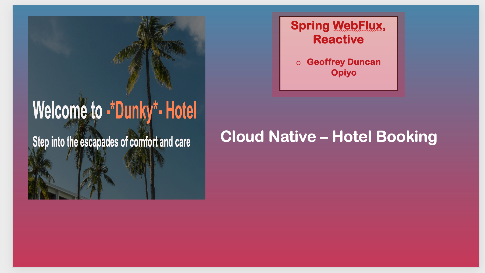
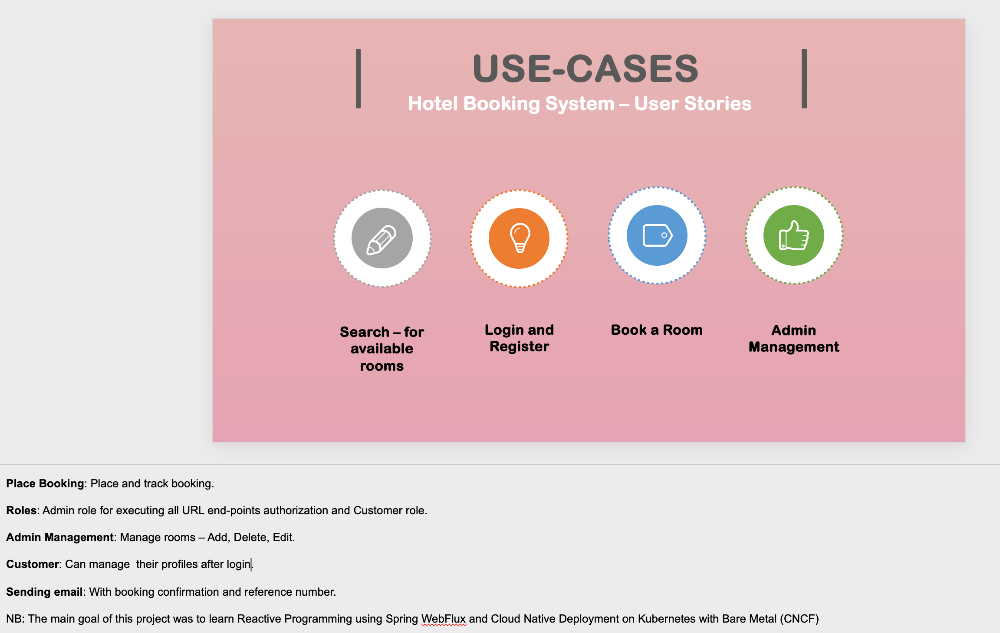

# 🌴 Dunky Hotel – Cloud Native Booking System

Welcome to **Dunky Hotel**, your step into the escapades of comfort and care — built with a modern cloud-native architecture using **Spring WebFlux** and **Kubernetes**.

> 🧑‍💻 *By Geoffrey Duncan Opiyo*

## 🌐 Overview

This project demonstrates a **reactive, scalable hotel booking system**, with an emphasis on **cloud-native deployment**. The primary goals were:
- Mastering **Reactive Programming** with Spring WebFlux.
- Building production-ready scalable services with app security in mind.
- Running in containers with **Kubernetes on Bare Metal (CNCF)**.

---

## 🎯 Core Use Cases

| Functionality         | Description                                             |
|----------------------|---------------------------------------------------------|
| 🔍 Search             | Discover available rooms                                |
| 🔐 Login & Register  | Authenticate as Customer or Admin                       |
| 🛏 Book a Room       | Select dates and reserve rooms                          |
| 🛠 Admin Management  | Admin-only panel to create, update, and delete rooms    |

---

## 🔐 Roles & Responsibilities

- **Admin**
    - Manages all endpoints (CRUD rooms)
    - Oversees user authorization
- **Customer**
    - Registers, logs in
    - Searches and books rooms
    - Updates preferences
    - View bookings history
- **Email Integration**
    - Sends confirmation and booking info

---

## 🚀 Tech Stack

- **Backend**: Java 17, Spring WebFlux (Reactive)
- **Frontend**: (React Frontend)
- **Deployment**: Kubernetes, Docker
- **Cloud Native**: Built to run on Bare Metal using CNCF stack

---

## 📩 Notes

> The main goal of this project was to learn **Reactive Programming using Spring WebFlux** and explore **Cloud Native Deployment on Kubernetes with Bare Metal (CNCF)**.

---

## 📸 Screenshots

